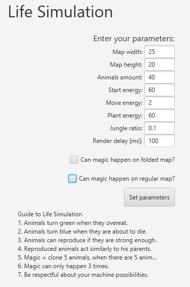

 <h1 align="center">Life simulation</h1>

  

  

    A wild life simulation program, that shows how cruel some living (or programmed) things can be.

## What is the Life Simulation about?

Life simulation is a program written in Java that was a final project for our Object Oriented Programming Course at AGH UST. We had to implement some Darwin Life's rules into RNG generated world with animals that want to just reproduce, eat and survive the next day.
 
Full project information (and its requirements) can be seen [here](https://github.com/apohllo/obiektowe-lab/tree/master/proj1).

## Starting parameters

* map width - the width of the map
* map height - the height of the map
* animals amount - the amount of animals spawned at start
* start energy - the amount of energy that animals spawn with
* move energy - the amount of energy it costs to move
* plant energy - the amount of energy the plant gives to an animal
* jungle ratio - percentage of the map which is covered by jungle
* render delay - delay which is waited before rendering next era

## Basic game rules:

- Animal can act only if its energy is above 0
- Animal can reproduce only if it has 50% or more energy (based on max capacity)
- Animal gets greener the more it eats
- Animal gets more blueish when it is close to death
- Maximum of 2 plants can spawn each era (one in jungle area, one outside jungle area)
- There can be more than 1 animal on each square
- If there are more than 1 animal on square on which plant has grown - the plant is evenly distributed between most healthy animals
- Only 1 pair of animals can reproduce per square per era
- And some more not mentioned rules [(check them out!)](https://github.com/apohllo/obiektowe-lab/tree/master/proj1)

## Screenshots

  
    

    Main menu, the first thing you see when starting the application.
        

  
      

    Application running and recording all the statistics, which you can export later on to a .csv file.
    

